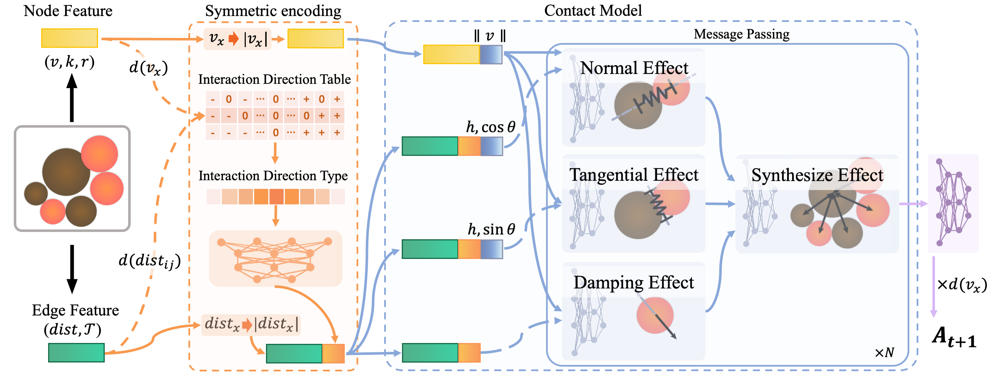

# Learning Solid Dynamics with Graph Neural Network

This is a code description of the Solid-GN model.



Visualization experiment results：


### Directory tree

```php
📦 root
 ┣ 📂 configs                   # Configuration files for datasets.
 ┣ 📂 data											# Dataset file. For each dataset, files include: training set dir, validation set dir, test set dir and metadata file.
 ┣ 📂 datasets                  # Preprocessing code for each datasets
 ┣ 📂 models                    # Implementation of the S-SGN model.
 ┣ 📜 train.py                  # Script for training the model.
 ┣ 📜 trainer.py                # Implementation of training details.
 ┣ 📜 eval.py                   # Script for testing the model.
 ┗ 📜 evaluator.py              # Implementation of testing details.

```

### Installation

- **Hardware**: Processor(64  Intel(R) Xeon(R) Gold 5218 CPU @ 2.30GHz) + NVIDIA GeForce RTX 3090.
- **Package**: numpy-1.19.5, torch-1.8.0+cu111.
- **Environment**: Proceed with the installation of the environment by executing the following command.

```shell
pip install -r requirements.txt
```

### Datasets

Based on the current limitations concerning the dataset size, we are presently sharing only two datasets, Slide and Slide-SameR. In the event of our paper being accepted, we will make the remaining datasets publicly available.

### Train

You can use the following commands for training：

```shell
python train.py --cfg {CONFIG_FILE} --exp-name {EXP_NAME} --dataset-name {DATASET}
```

Where:

- `{CONFIG_FILE}` is one of：
  - `configs/slide.yaml`
  - `configs/slide_same_r.yaml`
  - `configs/slide_plus.yaml`
  - `configs/crash.yaml`
  - `configs/sand.yaml`
- `{DATASET}` is one of:
  - `Slide`
  - `Slide_Same_R`
  - `Slide_Plus`
  - `Crash`
  - `Sand`

- `{EXP_NAME}` is customizable.

For example, training the **Slide** dataset:

```shell
python train.py --cfg configs/slide.yaml --exp-name slide-test --dataset-name Slide
```

### Evaluate

You can use the following commands for evaluation：

```shell
python eval.py --cfg {CONFIG_FILE} --ckpt ckpts/{EXP_NAME}/{PARAMETER} --data-dir {DATASET}/test
```

Where:

- `{PARAMETER}` is one of the checkpoint you saved.
- `{CONFIG_FILE}` , `{DATASET}` and `{EXP_NAME}` are the same as above.

For example, evaluate a training result:

```shell
python eval.py --cfg configs/slide_plus.yaml --ckpt ckpts/slide_plus-test/best_500000.path.tar --data-dir Slide_Plus/test
```

If you output visualization results, you can use:

```
python eval.py --cfg configs/slide_plus.yaml --ckpt ckpts/slide_plus-test/best_500000.path.tar --data-dir Slide_Plus/test --output-fig True
```

